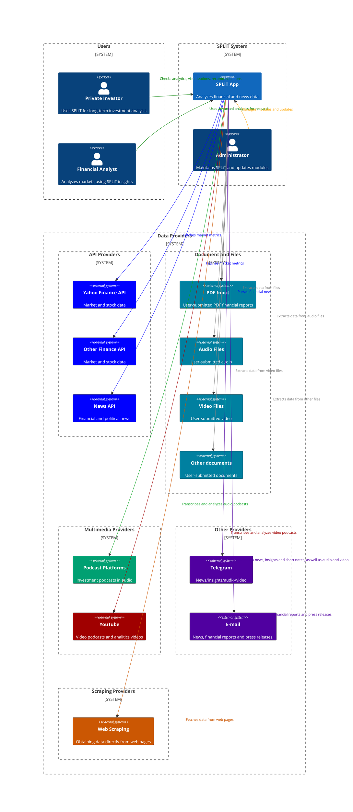

```mermaid

C4Context
System_Boundary(b1, "Users") {
    Person(user, "Private Investor", "Uses SPLiT for long-term investment analysis")
    Person(analyst, "Financial Analyst", "Analyzes markets using SPLiT insights")
    
}
System_Boundary(b0, "SPLiT System") {
    System(SPLIT, "SPLiT App", "Analyzes financial and news data")
    Person(admin, "Administrator", "Maintains SPLiT and updates modules")

}
System_Boundary(b2, "Data Providers") {
    System_Boundary(bAPI, "API Providers") {
        System_Ext(yahooAPI, "Yahoo Finance API", "Market and stock data")
        System_Ext(otherAPI, "Other Finance API", "Market and stock data")
        System_Ext(newsAPI, "News API", "Financial and political news")
    }
    System_Boundary(bDocs, "Document and Files") {
        System_Ext(pdfParser, "PDF Input", "User-submitted PDF financial reports")
        System_Ext(audioParser, "Audio Files", "User-submitted audio")
        System_Ext(videoParser, "Video Files", "User-submitted video")
        System_Ext(docParser, "Other documents", "User-submitted documents")
    }
    System_Boundary(bMedia, "Multimedia Providers") {
        System_Ext(podcastFeed, "Podcast Platforms", "Investment podcasts in audio")
        System_Ext(ytb, "YouTube", "Video podcasts and analitics videos")
    }
    System_Boundary(bOther, "Other Providers") {
        System_Ext(messengerIn, "Telegram", "News/insights/audio/video")
        System_Ext(emailInput, "E-mail", "News, financial reports and press releases.")
    }
    System_Boundary(bScraping, "Scraping Providers") {
        System_Ext(webscraping, "Web Scraping", "Obtaining data directly from web pages")
    }
}

Rel(user, SPLIT, "Checks analytics, visualizations, recommendations")
Rel(analyst, SPLIT, "Uses advanced analytics for research")
Rel(admin, SPLIT, "Manages modules and updates")

Rel(SPLIT, yahooAPI, "Fetches market metrics")
Rel(SPLIT, otherAPI, "Fetches market metrics")
Rel(SPLIT, newsAPI, "Parses financial news")

Rel(SPLIT, pdfParser, "Extracts data from files")
Rel(SPLIT, audioParser, "Extracts data from audio files")
Rel(SPLIT, videoParser, "Extracts data from video files")
Rel(SPLIT, docParser, "Extracts data from other files")


Rel(SPLIT, podcastFeed, "Transcribes and analyzes audio podcasts")
Rel(SPLIT, ytb, "Transcribes and analyzes video podcasts")

Rel(SPLIT, messengerIn, "Receives news, insights and short notes, as well as audio and video when needed")
Rel(SPLIT, emailInput, "Receives news, financial reports and press releases.")

Rel(SPLIT, webscraping, "Fetches data from web pages")

UpdateElementStyle(b0, $borderColor="black")
UpdateElementStyle(b1, $borderColor="black")

UpdateElementStyle(yahooAPI, $fontColor="white", $bgColor="blue", $borderColor="black")
UpdateElementStyle(otherAPI, $fontColor="white", $bgColor="blue", $borderColor="black")
UpdateElementStyle(newsAPI, $fontColor="white", $bgColor="blue", $borderColor="black")

UpdateElementStyle(pdfParser, $fontColor="white", $bgColor="#0080A0", $borderColor="black")
UpdateElementStyle(audioParser, $fontColor="white", $bgColor="#0080A0", $borderColor="black")
UpdateElementStyle(videoParser, $fontColor="white", $bgColor="#0080A0", $borderColor="black")
UpdateElementStyle(docParser, $fontColor="white", $bgColor="#0080A0", $borderColor="black")

UpdateElementStyle(podcastFeed, $fontColor="white", $bgColor="#00A072", $borderColor="black")
UpdateElementStyle(ytb, $fontColor="white", $bgColor="#A00000", $borderColor="black")

UpdateElementStyle(messengerIn, $fontColor="white", $bgColor="#5000A0", $borderColor="black")
UpdateElementStyle(emailInput, $fontColor="white", $bgColor="#5000A0", $borderColor="black")

UpdateElementStyle(webscraping, $fontColor="white", $bgColor="#CB5703", $borderColor="black")

UpdateRelStyle(user, SPLIT, $textColor="green", $lineColor="green", $offsetX="-40", $offsetY="-60")
UpdateRelStyle(analyst, SPLIT, $textColor="green", $lineColor="green", $offsetX="120", $offsetY="-60")
UpdateRelStyle(admin, SPLIT, $textColor="orange", $lineColor="orange", $offsetX="0", $offsetY="-20")

UpdateRelStyle(SPLIT, yahooAPI, $textColor="blue", $lineColor="blue", $offsetX="50", $offsetY="150")
UpdateRelStyle(SPLIT, otherAPI, $textColor="blue", $lineColor="blue", $offsetX="130", $offsetY="150")
UpdateRelStyle(SPLIT, newsAPI, $textColor="blue", $lineColor="blue", $offsetX="240", $offsetY="150")

UpdateRelStyle(SPLIT, pdfParser, $textColor="grey", $lineColor="grey", $offsetX="60", $offsetY="330")
UpdateRelStyle(SPLIT, audioParser, $textColor="grey", $lineColor="grey", $offsetX="190", $offsetY="330")
UpdateRelStyle(SPLIT, videoParser, $textColor="grey", $lineColor="grey", $offsetX="50", $offsetY="420")
UpdateRelStyle(SPLIT, docParser, $textColor="grey", $lineColor="grey", $offsetX="180", $offsetY="420")

UpdateRelStyle(SPLIT, podcastFeed, $textColor="#00A018", $lineColor="#00A018", $offsetX="50", $offsetY="600")
UpdateRelStyle(SPLIT, ytb, $textColor="#A00000", $lineColor="#A00000", $offsetX="210", $offsetY="600")

UpdateRelStyle(SPLIT, messengerIn, $textColor="#5000A0", $lineColor="#5000A0", $offsetX="50", $offsetY="790")
UpdateRelStyle(SPLIT, emailInput, $textColor="#5000A0", $lineColor="#5000A0", $offsetX="60", $offsetY="880")

UpdateRelStyle(SPLIT, webscraping, $textColor="#CB5703", $lineColor="#CB5703", $offsetX="50", $offsetY="1060")
```

UpdateLayoutConfig($c4ShapeInRow="5", $c4BoundaryInRow="1")
