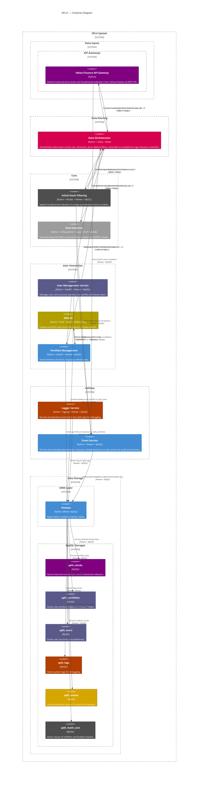

```mermaid
C4Container
title SPLiT — Container Diagram

System_Boundary(b_main, "SPLit System") {
    
    System_Boundary(b_in, "Data Inputs") {
        System_Boundary(b_apis, "API Gateways") {
            Container(yahooAPIGateway, "Yahoo Finance API Gateway", "Python", "Fetches historical price series and fundamental indicators from Yahoo Finance via REST API.")
        }
    }

    System_Boundary(b_routes, "Data Routing") {
        Container(dataOrchestrator, "Data Orchestrator", "Python + Celery + Redis", "Orchestrates tasks (each carries user_id/session_id) via Redis+Celery; subscribes to completions; logs statuses in eventSrv.")

        Rel(webUI,          portfolioMngr,    "Refresh Data",                                    "REST/HTTP")
        Rel(portfolioMngr,  dataOrchestrator, "Enqueue “refresh” task (includes user_id)",      "Redis + Celery")
        Rel(dataOrchestrator, yahooAPIGateway,"Enqueue market data fetch task (includes user_id)","Redis + Celery")
        Rel(yahooAPIGateway, dataOrchestrator, "Emit fetch-completed event (includes user_id)", "Redis + Celery")
        Rel(dataOrchestrator, initlFilter,     "Enqueue initial filtering task (includes user_id)","Redis + Celery")
        Rel(initlFilter,     dataOrchestrator, "Emit filtering-completed event (includes user_id)","Redis + Celery")
        Rel(dataOrchestrator, finalSel,        "Enqueue final selection task (includes user_id)", "Redis + Celery")
        Rel(finalSel,        dataOrchestrator, "Emit selection-completed event (includes user_id)","Redis + Celery")
        Rel(dataOrchestrator, portfolioMngr,   "Notify data refresh complete (includes user_id)","Redis + Celery")
        Rel(portfolioMngr,   webUI,            "Return refreshed portfolio data",                 "REST/HTTP or WebSocket")
    }

    System_Boundary(b_core, "Core") {
        Container(initlFilter, "Initial Stock Filtering", "Python + Pandas + Peewee + MySQL", "Applies fundamental indicators to assign quantitative scores to tickers.")
        Container(finalSel,    "Final Selection",        "Python + SciPy.optimize + cvxpy + PuLP + MySQL",  "Generates Buy/Hold/Sell recommendations based on initlFilter results.")

        Rel(yahooAPIGateway, eventSrv, "Record fetch task completion",      "Peewee + MySQL")
        Rel(initlFilter,     eventSrv, "Record filtering task completion", "Peewee + MySQL")
        Rel(finalSel,        eventSrv, "Record selection task completion", "Peewee + MySQL")
    }
    
    System_Boundary(b_users, "User Interaction") {
        Container(userMgmt,      "User Management Service", "Python + FastAPI + Peewee + MySQL", "Manages user_zero account; persists user profiles and future users.")
        Container(webUI,         "Web UI",                  "Python + Flask + Jinja2 + Tailwind CSS", "Displays portfolio and recommendations; initiates refresh.")
        Container(portfolioMngr, "Portfolio Management",    "Python + FastAPI + Peewee + MySQL", "Stores fixed list of tickers; enqueues refresh tasks.")

        Rel(userMgmt,     peewee, "Creates/updates user profiles in split_users",      "Peewee + MySQL")
        Rel(portfolioMngr, peewee, "Stores portfolio composition in split_portfolios", "Peewee + MySQL")
    }

    System_Boundary(b_util, "Utilities") {
        Container(logSrv,   "Logger Service", "Python + logging + Peewee + MySQL", "Records all operations and errors into split_logs for debugging.")
        Container(eventSrv, "Event Service",  "Python + Peewee + MySQL",             "Persists task metadata (timestamps, statuses, initiator/executor) in split_events for audit and recovery.")

        Rel(logSrv,   peewee, "Writes logs to split_logs",                     "Peewee + MySQL")
        Rel(eventSrv, peewee, "Writes task metadata to split_events.events_log","Peewee + MySQL")
    }

    System_Boundary(b_dataSt, "Data Storage") {
        System_Boundary(b_ORM, "ORM Layer") {
            Container(peewee, "Peewee", "Python ORM for MySQL", "Maps Python models to MySQL tables.")
        }
        System_Boundary(b_MySQLs, "MySQL Storages") {
            Container(split_stocks,     "split_stocks",     "MySQL", "Stores historical market data and fundamental indicators.")
            Container(split_portfolios, "split_portfolios", "MySQL", "Stores user portfolio tickers and change history.")
            Container(split_users,      "split_users",      "MySQL", "Stores user accounts and preferences.")
            Container(split_logs,       "split_logs",       "MySQL", "Stores system logs for debugging.")
            Container(split_events,     "split_events",     "MySQL", "Stores task/event statuses for audit and recovery.")
            Container(split_math_core,  "split_math_core",  "MySQL", "Stores results of initlFilter and finalSel modules.")
        }

        Rel(peewee, split_stocks,     "Persists fetched market data",               "Peewee + MySQL")
        Rel(peewee, split_portfolios, "Persists portfolio data",                    "Peewee + MySQL")
        Rel(peewee, split_users,      "Persists user profile data",                 "Peewee + MySQL")
        Rel(peewee, split_logs,       "Persists log entries",                       "Peewee + MySQL")
        Rel(peewee, split_events,     "Persists task/event metadata",               "Peewee + MySQL")
        Rel(peewee, split_math_core,  "Persists analysis results",                  "Peewee + MySQL")
    }
}

UpdateElementStyle(yahooAPIGateway, $bgColor="#800080")
UpdateElementStyle(dataOrchestrator, $bgColor="#D7004F")
UpdateElementStyle(initlFilter, $bgColor="#4E4E4E")
UpdateElementStyle(finalSel, $bgColor="#9C9C9C")
UpdateElementStyle(userMgmt, $bgColor="#5a5a8a")
UpdateElementStyle(webUI, $bgColor="#B39E00")
UpdateElementStyle(logSrv, $bgColor="#B33F00")
UpdateElementStyle(split_stocks,     $bgColor="#800080")
UpdateElementStyle(split_portfolios, $bgColor="#5a5a8a")
UpdateElementStyle(split_users,      $bgColor="#5a5a8a")
UpdateElementStyle(split_logs,       $bgColor="#B33F00")
UpdateElementStyle(split_events,     $bgColor="#D7A500")
UpdateElementStyle(split_math_core,  $bgColor="#4E4E4E")

UpdateLayoutConfig($c4ShapeInRow="5", $c4BoundaryInRow="1")
```
